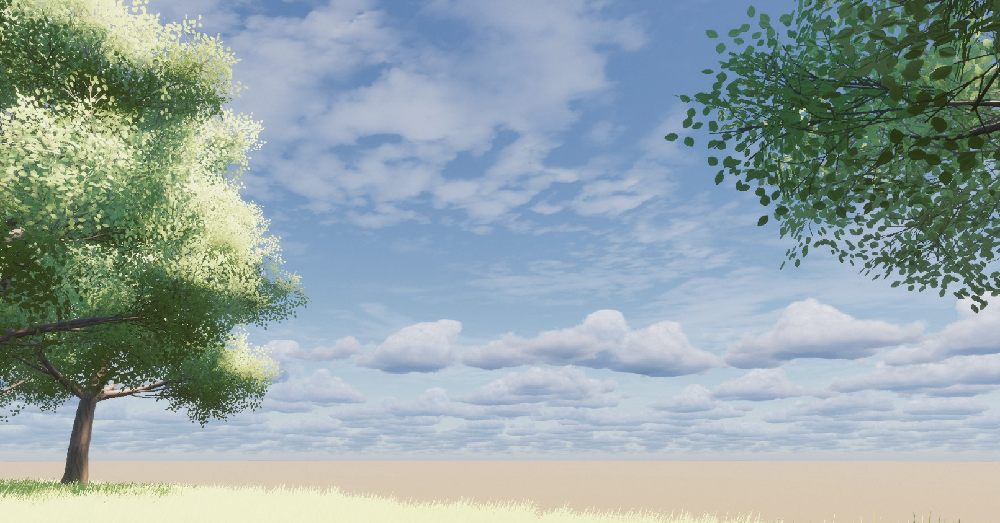
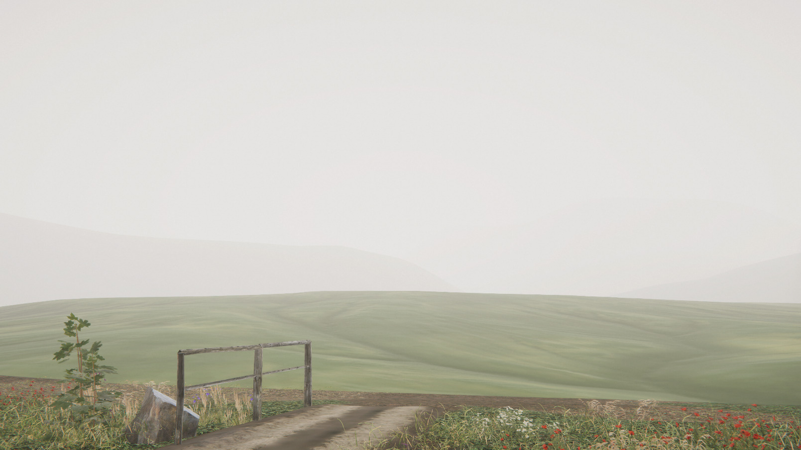
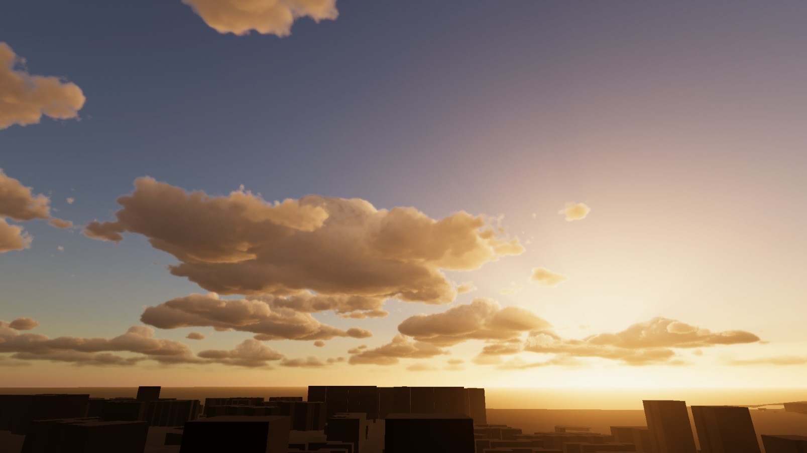
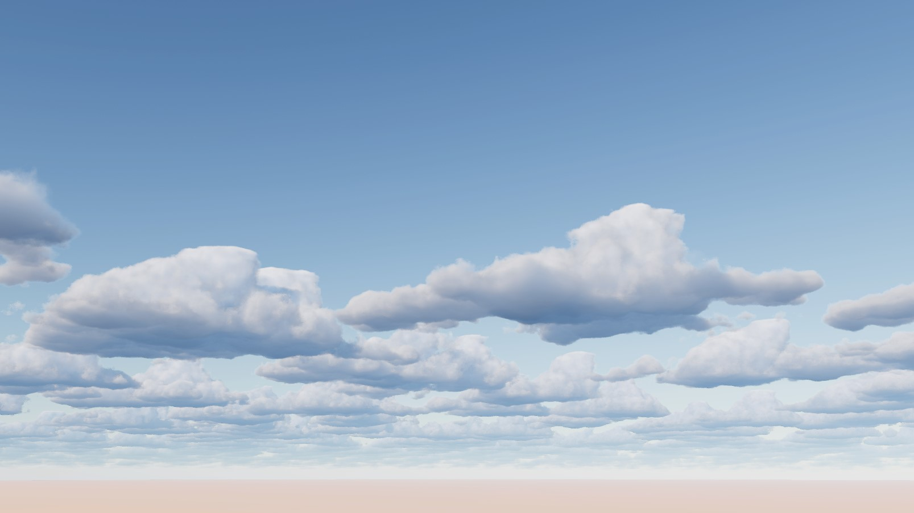
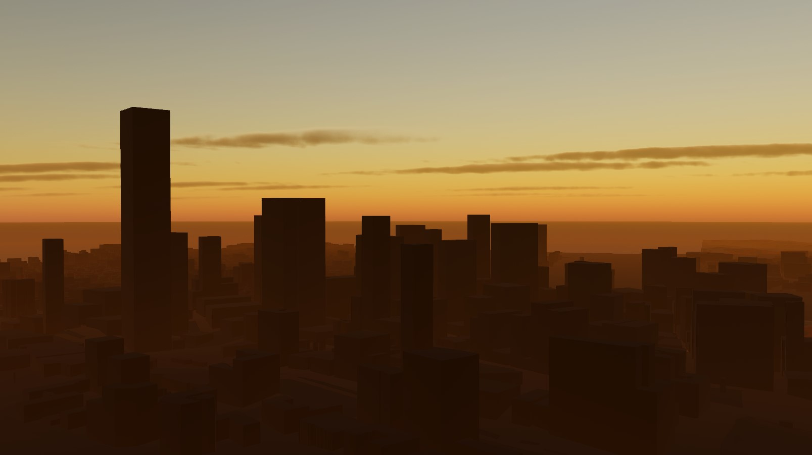
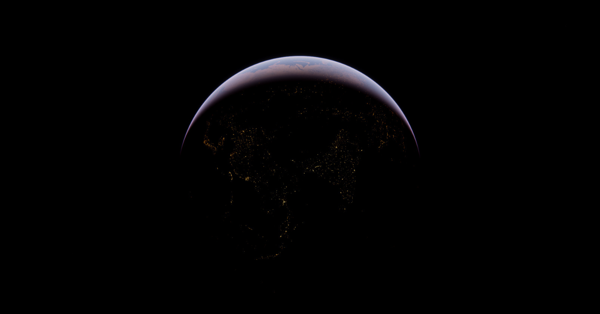
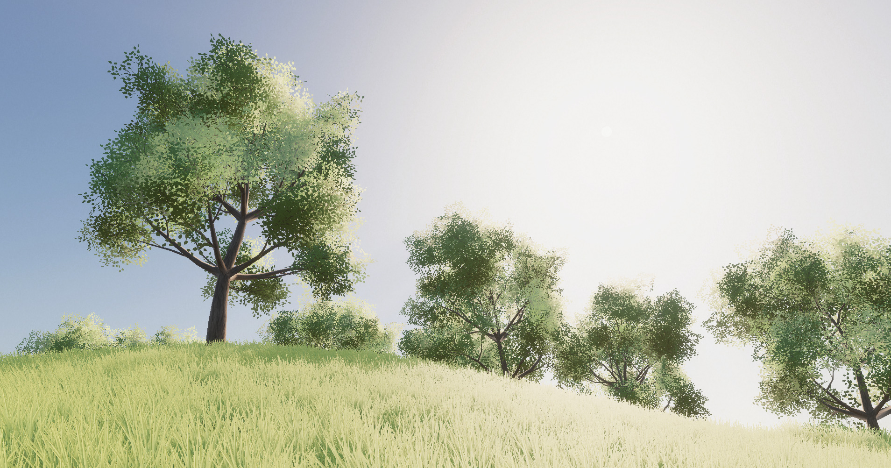

# Expanse Documentation

> Welcome to the docs for the unity volumetric clouds plugin, Expanse!

If you've arrived at this page, chances are you're looking for a robust, realistic, performant sky and clouds system for your game, visualization tool, or other immersive digital experience. Expanse might be the Unity asset for you.

However, there are some things that it is not suited for. It's best we get these things out of the way up front, since I'd hate for you to license Expanse and discover that it doesn't do what you need it to! **If any of the following are things you need, look toward one of the other fantastic assets on the asset store.**

* **Support in the URP or Builtin render pipelines**. Expanse only supports the High Definition Render Pipeline (HDRP), because it is targeted at high-end platforms---current and next-gen consoles and gaming PC's. In theory, it is performant enough to run on lower-end hardware, so maybe in the future I will port it to the other pipelines.
* **Performant cloud fly-through**. Expanse uses a technique called reprojection to render extremely realistic clouds in realtime. It starts to break down when you get inside the clouds, and artifacts are visible. It's possible to disable reprojection and instead render clouds at a lower resolution, but the point stands: **Expanse is not optimized for cloud fly-throughs**.
* **Multiple planets in a small solar system: a la Outer Wilds**. You cannot easily create multiple atmospheres in a single scene, because Expanse is backed by the [Sky and Fog Volume system](https://docs.unity.cn/Packages/com.unity.render-pipelines.high-definition@7.1/manual/Override-Visual-Environment.html). Only one sky can be visible at a time.
* **Support on Nintendo Switch**. This is a sad side effect of using HDRP. Although in theory the Switch supports all the features necessary to run Expanse, the HDRP doesn't support the Switch. If and when it does, Expanse should work just fine.

Ok, with that out of the way, let's get into the good stuff. **Here are some reasons you might decide to use Expanse for your project**.

* **You want instant photorealism**. This is maybe a little corny, but it's true---Expanse comes preloaded with tons of presets for different cloud patterns, atmospheric conditions, and celestial bodies. Transporting your scene to the surface of Mars is a matter of dragging and dropping in a prefab and selecting a preset.
* **You want a physically-based solution**. Expanse is entirely physically-based. Everything from the [state-of-the-art multiple scattering model](https://sebh.github.io/publications/egsr2020.pdf) to the [special Moon BRDF](https://graphics.stanford.edu/~henrik/papers/nightsky/nightsky.pdf) are based off of the most recent papers coming out of SIGGRAPH.
* **You need a day/night cycle**. This is probably the number one reason to use a system like Expanse. If you want dynamic time of day, a photoreal skybox is no longer an option. Expanse is perfect for this application.
* **You need moving clouds**. Even if you don't need a full day/night cycle, you may need clouds that move across the sky and cast shadows on geometry. Expanse supports both of these things.
* **You want full control over every aspect of your atmospheric model**. Expanse exposes a lot of parameters, but it does so in a modular way so that the UI remains manageable. You can build any atmosphere, celestial body, or cloud layer from the ground up.
* **You have strict performance requirements**. Expanse exposes a number of tradeoffs between quality and performance. On a last-gen 2080 Ti, Expanse can render an entire sky, with volumetric atmosphere, clouds, and fog, illuminated by both the sun and moon, **in under 1ms.**

There's more to talk about, but those are the highlights.

## The Purpose of This Site

These are the Expanse Docs---any questions you have about how to use Expanse and how to interact with it programmatically should be answerable here. If something's missing, please, let me know on the [Expanse Unity forum! TODO LINK HERE!]()

I also highly recommend checking out the [video tutorials I've posted for Expanse. TODO LINK HERE!]() These docs are largely meant to be a reference for you once you have a general understanding of how Expanse works. If you try to dive right into the [blocks documentation](/editor/blocks/blocks), you might find yourself a little confused.

You can also check out the [quick start section](/quickstart/quickstart) for a crash course.

## Feature List

Here's a list of all the big features that Expanse supports. There are many things that have been left off of this list for brevity's sake, but this should cover most of the important bases.

* Physically-based atmospheric scattering. This includes Rayleigh, Mie, and isotropic scattering, capable of modeling everything from the blue color of the sky on Earth to the yellow sulfuric clouds of Venus.
* Physically-based volumetric fog and aerial perspective.
* Procedural physically-based volumetric clouds.
* Procedural physically-based 2D clouds (a more performant alternative to the volumetric clouds).
* Procedural nebulae.
* Procedural star fields.
* Support for up to eight celestial bodies that illuminate the clouds and atmosphere, and cast cloud shadows. This can be suns, planets, rocky moons, gas giants, etc.
* Option to use preauthored textures wherever procedurally-generated textures are used.

## Eye Candy

If you want to get an idea of what's possible with Expanse, here's a few examples to get your imagination running. Stylized, realistic---it's all possible with Expanse!

    

        

        

    

    

        

        

        <!-- 

 -->
    

    

        

        

    

    

        

        

    

    

        

        

    

