# Atmosphere Layer Block

> Implemented as class `Expanse.AtmosphereLayerBlock` in `blocks/AtmosphereLayerBlock.cs`

Atmosphere layers...

<!-- 
    /* Parameters. */

    /* Modeling. */

    /* Lighting. */ 
    [ColorUsageAttribute(true,true), Tooltip("Extinction coefficients control the absorption of light by the atmosphere.")]
    public Color m_extinctionCoefficients = new Color(0.0000058f, 0.0000135f, 0.0000331f, 1.0f);
    [ColorUsageAttribute(true,true), Tooltip("Scattering coefficients control the scattering of light by the atmosphere. Should be less than extinction to remain physical.")]
    public Color m_scatteringCoefficients = new Color(0.0000058f, 0.0000135f, 0.0000331f, 1.0f);
    [Tooltip("Phase function to use for this atmosphere layer. Isotropic phase functions are useful for modeling simple non-directional scattering. The Rayleigh phase function is useful for modeling air and gases. The Mie phase function is good for modeling smoke, fog, and aerosols.")]
    public AtmosphereDatatypes.PhaseFunction m_phaseFunction = AtmosphereDatatypes.PhaseFunction.Rayleigh;
    [Range(-1, 1), Tooltip("Anisotropy of this atmosphere layer. Higher values will give more forward scattering. Lower values will give more backward scattering. A value of zero is neutral---i.e. it will produce \"isotropic\" scattering.")]
    public float m_anisotropy = 0.7f;
    [Tooltip("Tint to this atmosphere layer. Artistic override. A tint of perfect grey (127, 127, 127) is neutral. It's often preferable to first adjust the scattering and extinction coefficients, as this will alter the color in a way that is physically-based.")]
    public Color m_tint = Color.grey;
    [Min(0), Tooltip("Multiple scattering multipler for this atmosphere layer. Artistic override. 1 is a physically accurate value.")]
    public float m_multipleScatteringMultiplier = 1;

    /* Shadows. */
    [Tooltip("Whether or not to compute screenspace volumetric shadows from geometry for this layer.")]
    public bool m_geometryShadows = false;
    [Tooltip("Whether or not to compute screenspace volumetric shadows from clouds for this layer. Disable if you aren't using any clouds.")]
    public bool m_cloudShadows = false;
    [Range(0, 1), Tooltip("The maximum occlusion value that screenspace shadows can have. This is useful for allowing some light to leak in and soften the volumetric shadows.")]
    public float m_maxOcclusion = 0.9f; -->

<!---------------------------------------------------------------------------------------->
<!--------------------------------------- MODELING --------------------------------------->
<!---------------------------------------------------------------------------------------->
### Modeling
These parameters describe the distribution of the layer's participating media---thickness, density distribution, etc.

#### Density
**C# member variable:** `float m_density` \
The density of the participating media. This together with the scattering/extinction coefficients determines the way the media absorbs and scatters light. As such its units/scale depend on the choice of units for the scattering/extinction coefficients.

    

        
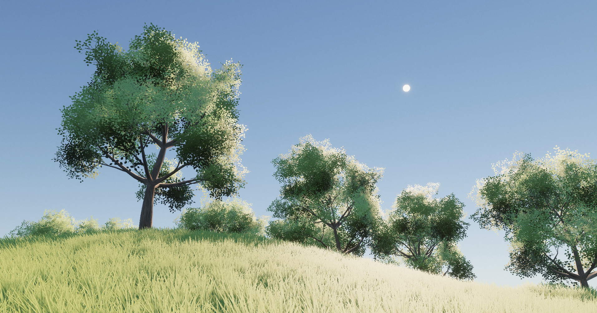

        
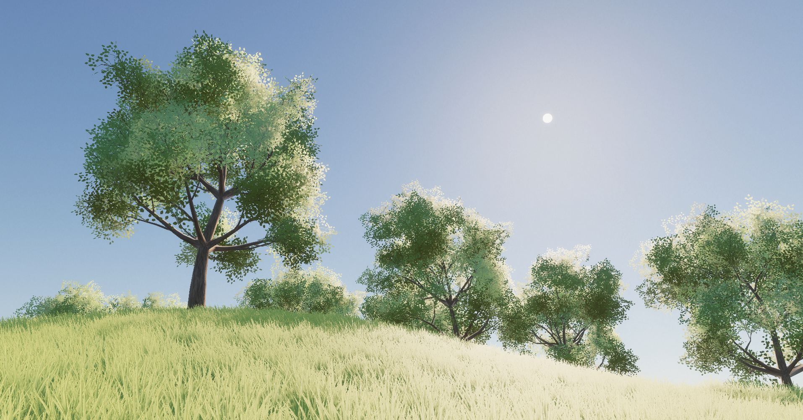

        
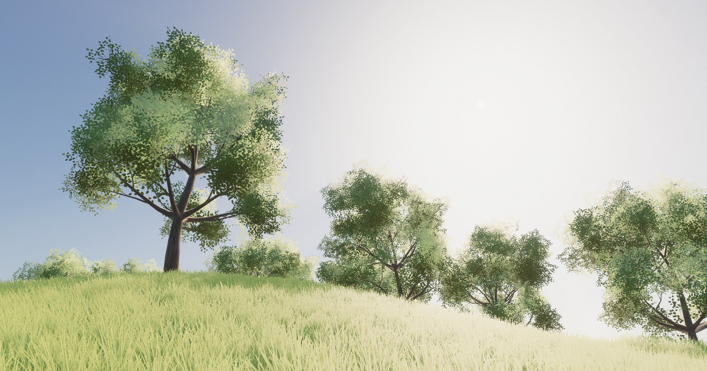

    

    
Left to right: aerosol densities of 0, 1, and 10. All of these represent plausible Earth atmospheres, since the aerosol density varies greatly across Earth biomes. In the middle of a densely populated city, it can be very high. On a sunny day in a grassland, it might be close to zero.

    

        
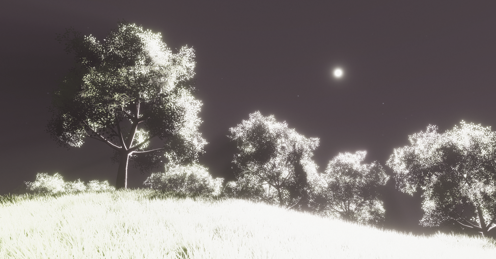

        
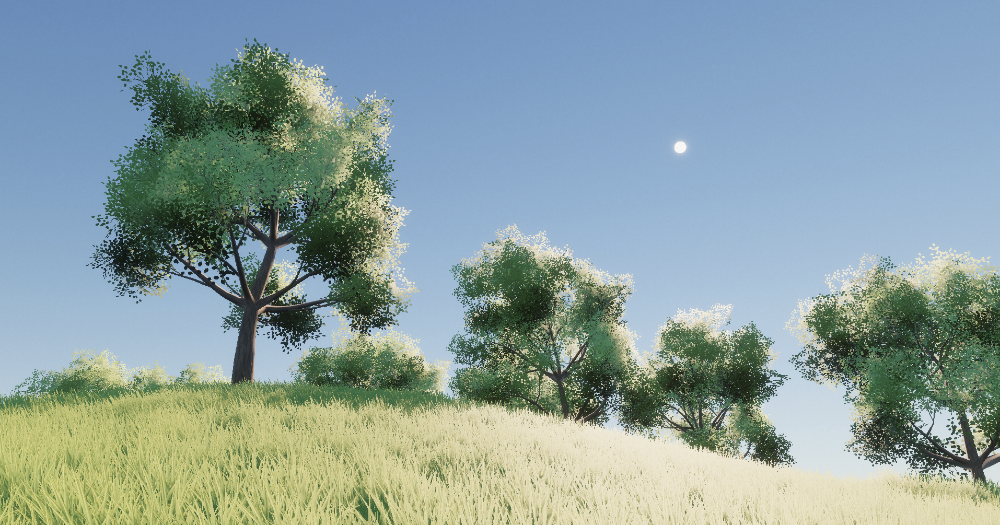

        
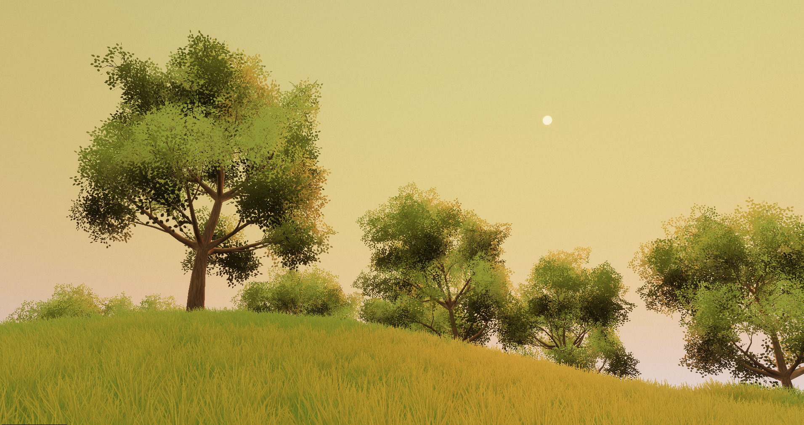

    

    
Left to right: rayleigh densities of 0, 1, and 10. The density of Earth's rayleigh scattering layer is pretty much constant across the planet, so only the middle image represents a plausible Earth environment. With a density of 0, we're pretty much in empty space, so the sky is black! With a density of 10, the absorptive characteristics of the media take over, and the sky appears a reddish orange, like the sunset. It really is a beautiful coincidence that Earth's atmosphere is just dense enough to display a wide range of colors throughout the day/night cycle.

#### Density Distribution
**C# member variable:** `Expanse.AtmosphereDatatypes.DensityDistribution m_density` \
The density distribution of the participating media---in other words, how the gases in this atmosphere layer are distributed around the Earth. Expanse supports four density distributions, split into two categories based on how they are rendered and what features they support: [Regular Distributions](/editor/blocks/atmosphere_layer_block?id=regular-distributions) and [Screenspace Distributions](/editor/blocks/atmosphere_layer_block?id=screenspace-distributions).

##### Regular Distributions

Expanse provides two efficient density distribution models that will suit most of your needs.

>Exponential

Exponential layers are, most likely, the bread-and-butter building blocks you'll be working with to build your atmosphere. They are very dense near the surface of the earth, and then get less dense as you get farther up into the atmosphere, until at some distance they are basically zero. Many phenomena in nature exhibit this kind of pattern, and atmosphere gas distributions are no exception.

Earth's atmosphere is modelable as two exponential layers: one that exhibits "rayleigh" scattering---responsible for the sky's blue color---and another that exhibits "mie" scattering---responsible for the bright air glow around the sun disc.

More sophisticated models may take into account the ozone layer, which is modelable in Expanse as a tent distribution (see the next density distribution type).

    

        
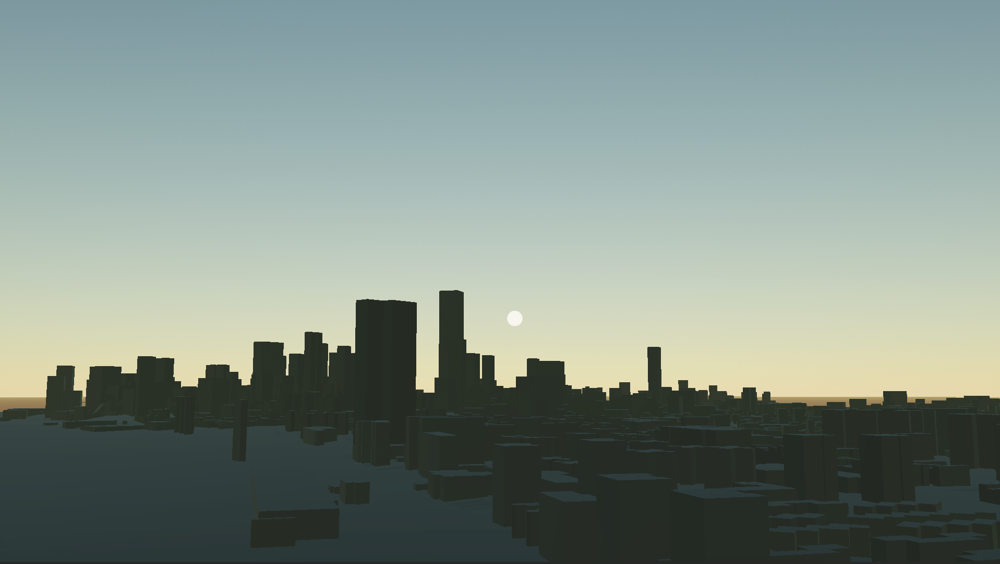

        
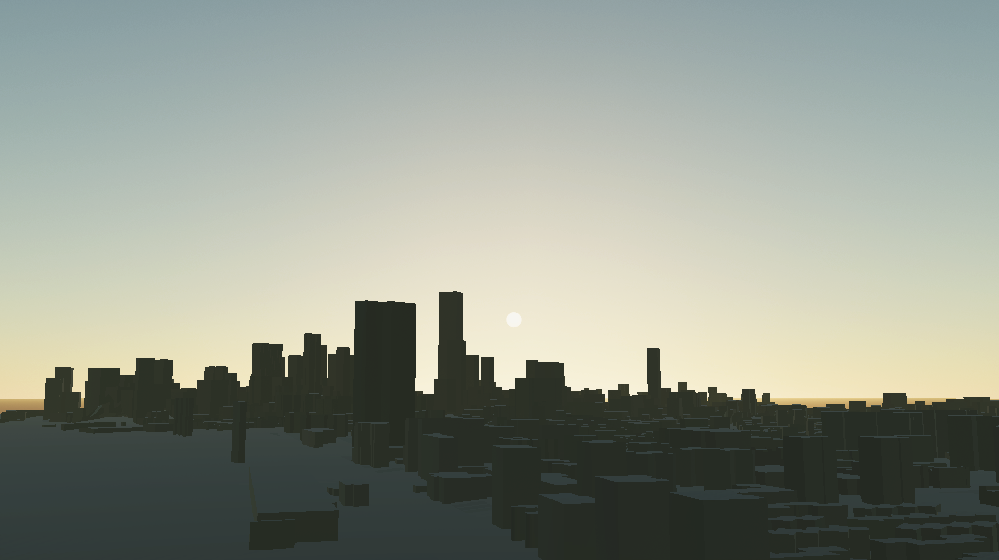

    

    
Left: one exponential layer, setup to mimic Earth's nitrogen/oxygen/carbon dioxide atmosphere. Right: the same setup as left, but with an additional exponential layer that models aerosols like smoke and smog, creating the characteristic air glow around the sun disc.

>Tent

The tent distribution has a maximum value at a particular altitude, its "height" parameter, and then decays above and below that value. It's good for modeling "bands" of gas that are concentrated at a particular height above the ground.

The ozone is one of those layers. Modeling the ozone is not strictly necessary, but is key to making the sky appear properly blue in the daytime, and appropriately purple in the evening.

    

        

        
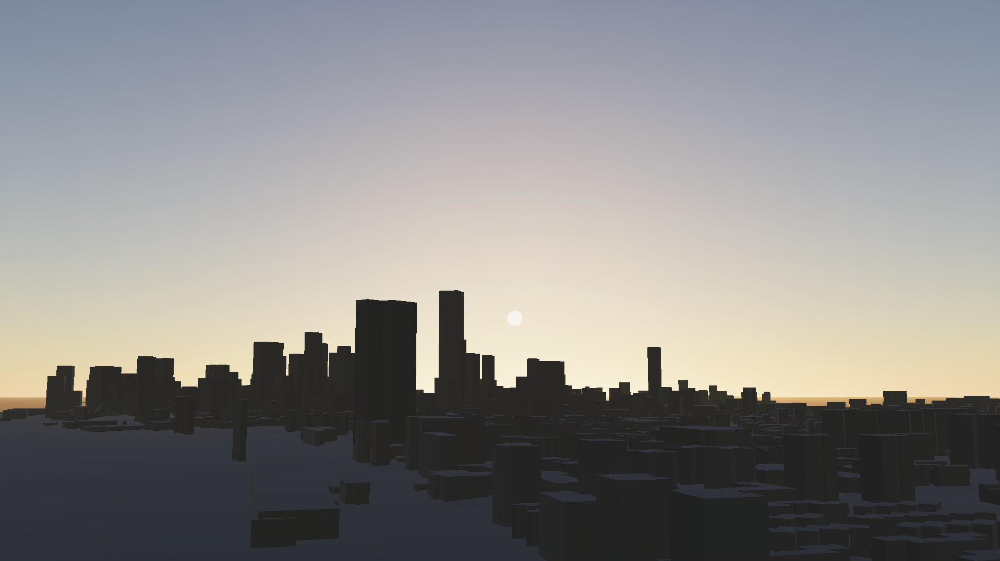

    

    
Left: atmosphere with just exponential rayleigh and mie layers. Right: with the ozone added in. Notice how it better approximates the purple twilight we are all familiar with.

##### Screenspace Distributions

Normally, Expanse renders atmosphere layers to a low-resolution spherical texture, and then composites them into the camera's rectangular framebuffer. This is, more or less, why it can afford to use an expensive but physically accurate rendering algorithm in realtime. However, this strategy is limiting in that it cannot resolve sharp, volumetric shadows---crepuscular or "god" rays.

To address this, Expanse introduces the concept of screenspace layers---layers that are rendered in a less expensive (but still physically-based) fashion, per-camera pixel. Their main benefit is that they are free of some of the artifacts present in the spherical texture, they support a falloff distance from the player, and they support a form of screenspace volumetric shadowing. As such they are particularly useful for modeling fog, smoke, and other dense aerosols.

With volumetric shadows turned off, these layers are extremely performant. However, with volumetric shadows on, they will perform raymarching against a downsampled version of the depth buffer. This can reduce performance---the performance hit can be mitigated by choosing an appropriate [depth buffer downsample factor](/editor/blocks/quality_settings_block?id=screenspace-depth-downscale) in your [quality settings block](/editor/blocks/quality_settings_block).

>Screenspace Uniform

A screenspace layer that is distributed uniformly within a constant radius around the camera. This is particularly useful for modeling atmospheric effects like rain fog and smoke.

    

        

        
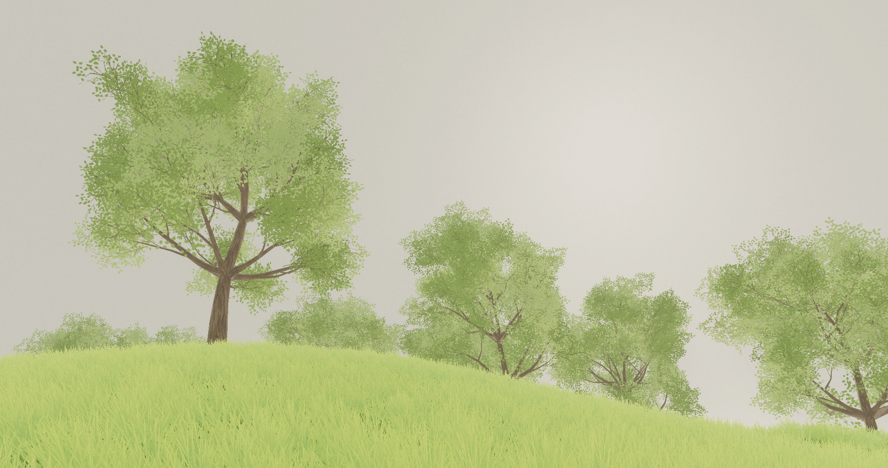

        
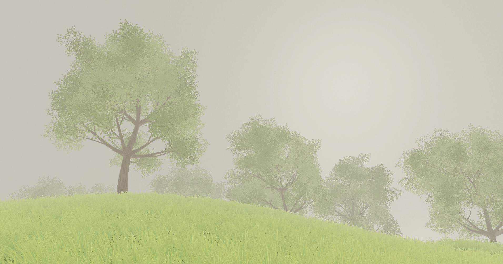

    

    
Screenspace uniform "rain fog" at varying densities. Left to right: 0, 300, 3000.

>Screenspace Height Fog

A screenspace layer that is distributed exponentially from the plane aligned to the ground where the camera is placed, extending outward to a specified attenuation radius. This layer can mimic the regular exponential layer, though not perfectly, as it will fail to capture the curvature of the planet (sorry flat-earthers). 

As its name suggests, it's good for modeling height fog. It can also be a duplicate of the usual exponential aerosol layer, set up to provide some volumetric shadowing effects.

    

        
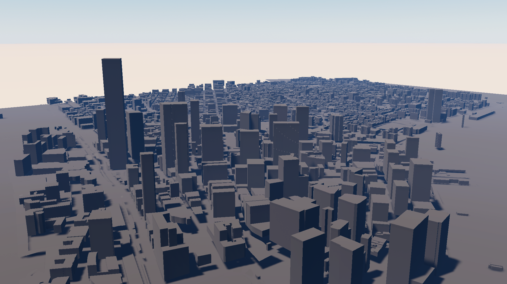

        
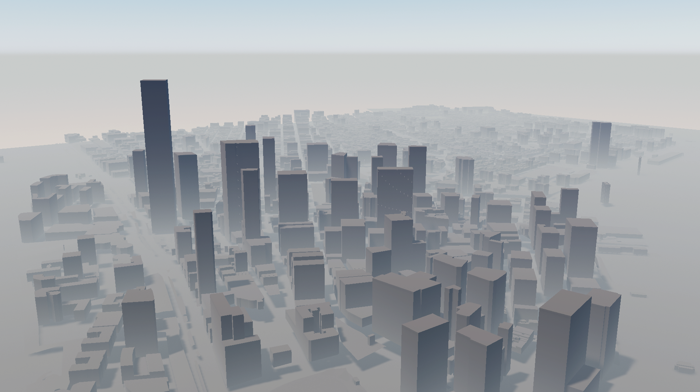

        
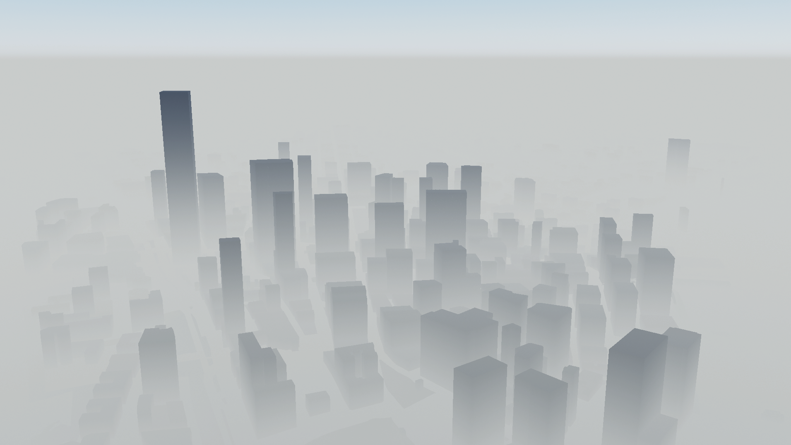

    

    
Screenspace height fog at varied densities. Left to right: zero, 300, 1500.

    

        

        
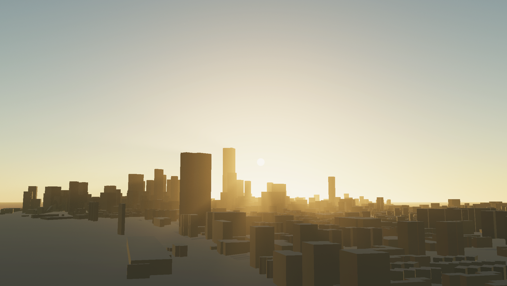

    

    
Left: atmosphere set up with a regular exponential aerosol layer. Right: atmosphere set up with a screenspace height fog aerosol layer, with the density cranked up to make the volumetric shadowing effect visible.

<!-- [Tooltip("Density distribution type for this atmosphere layer.")]
    public AtmosphereDatatypes.DensityDistribution m_densityDistribution = AtmosphereDatatypes.DensityDistribution.Exponential;
    [Min(0), Tooltip("Density of this atmosphere layer.")]
    public float m_density = 1;
    [Tooltip("Height of this atmosphere layer in world units.")]
    public float m_height = 25000;
    [Min(0), Tooltip("Thickness of this atmosphere layer in world units.")]
    public float m_thickness = 8000; -->

<!---------------------------------------------------------------------------------------->
<!--------------------------------------- MATERIAL --------------------------------------->
<!---------------------------------------------------------------------------------------->
### Material
These parameters describe the material appearance of the planet.

#### Ground Albedo Texture
**C# member variable:** `Cubemap m_groundAlbedoTexture` \
The ground albedo, specied as a cubemap. The ground is modeled as a Lambertian (completely diffuse) reflector. If no texture is specified, the color of the ground will just be the ground tint.

    

        
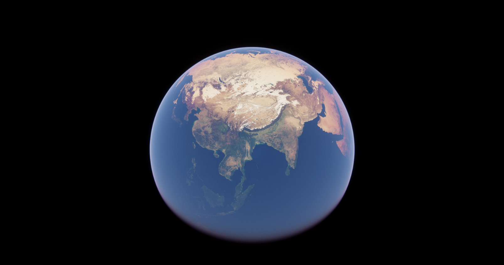

    

    
An example of a ground albedo texture, in this case, Earth's.

<!---------------------------------------------------------------------------------------->
<!--------------------------------------- METADATA --------------------------------------->
<!---------------------------------------------------------------------------------------->
### Metadata
These parameters are metadata or references to components/objects that the block uses.

#### Name
**C# member variable:** `m_name` \
The name for this layer used in debug and error printouts.

#### Volume
**C# member variable:** `m_volume` \
The Sky and Fog Volume that backs this atmosphere layer block. In all likelihood, this should be a single global volume you set up at the start of your project. More complex workflows may have multiple local volumes, in which case you will need to create multiple atmosphere layer blocks (one for each volume), or programmatically change this parameter.
