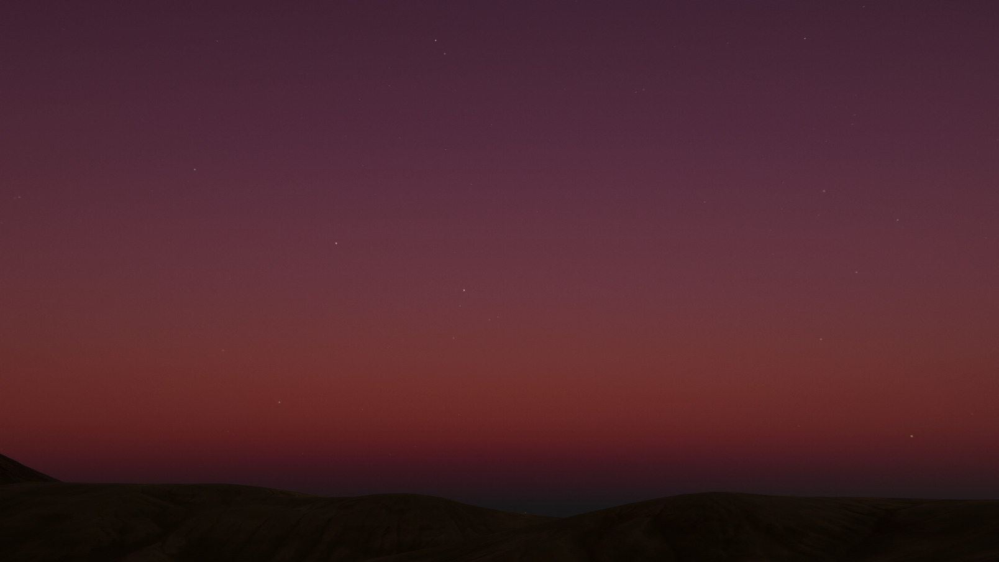

# Celestial Body Block

> Implemented as class `Expanse.CelestialBodyBlock` in `blocks/CelestialBodyBlock.cs`

    

        

    

For any planet, star, or other spherical object in the sky...

<!---------------------------------------------------------------------------------------->
<!--------------------------------------- MODELING --------------------------------------->
<!---------------------------------------------------------------------------------------->
### Modeling
These parameters describe the shape, orientation, and pose of the celestial body.

#### Direction
**C# member variable:** `Vector3 m_direction` \
The direction of the celestial body in the sky. Specified as euler angles, with the same convention as Unity's directional light. 

Expanse does not currently support a date-time system for sun and moon phases (though there are plans to implement it soon). However, there are plenty of open-source implementations that you can easily plug into this direction value, like [this one from Paul Hayes](https://gist.github.com/paulhayes/54a7aa2ee3cccad4d37bb65977eb19e2). Or, there are paid assets on the asset store that will handle this for you, like [this wonderful one by Hessburg](https://assetstore.unity.com/packages/tools/particles-effects/sunlight-location-based-time-of-day-66399?_ga=2.207635986.1863241710.1613015454-690325339.1599460279&aid=1011l37no&pubref=sunlight&utm_source=aff).

#### Angular Radius
**C# member variable:** `float m_angularRadius` \
The size of the celestial body in the sky, specified as an angular radius in degrees. The angular radius of the sun and moon are both about `0.5` degrees, but this can often appear too small, for a number of reasons related to the psychology of visual perception.

    

        

        

        

    

    
Left: angular radius of 0.5. Middle: angular radius of 2. Right: angular radius of 8.

#### Penumbra
**C# member variable:** `float m_penumbra` \
Multiplier on the angular radius used to compute the celestial body's penumbra. Good for smoothing out the sky shadow for smaller bodies, or for reducing artifacts for very large bodies. 1 is a "physical" value, though the way Expanse computes sun disc illumination is an approximation anyway.

    

        

        

        

    

    
Left: penumbra multiplier of 1, so "physically accurate". Middle: penumbra multiplier of 5, which is a bit more visually pleasing. Right: penumbra multiplier of 11, which is perhaps too extreme.

#### Distance
**C# member variable:** `float m_distance` \
Celestial body's distance from the center of the planet, in meters. The distance from the Earth to the sun is `1.5 x 10^11` meters. The distance to the moon is `3.8 x 10^8` meters.

#### Tidally Locked
**C# member variable:** `bool m_tidallyLocked` \
Whether or not the celestial body is tidally locked. This means that the same side of the celestial body always faces the planet---for instance, like Earth's moon, Luna.

<!---------------------------------------------------------------------------------------->
<!--------------------------------------- LIGHTING --------------------------------------->
<!---------------------------------------------------------------------------------------->
### Lighting
These parameters determine the way the celestial body illuminates the scene.

#### Light Intensity
**C# member variable:** `float m_lightIntensity` \
Light intensity of the celestial body, in lux. In particular this is the illuminance on the ground when the body is at the zenith position. 

A typical value for the sun is `150000`, and a typical value for the moon is between `1-3`. These values do not always integrate well with existing material workflows that are not physically-based, and can be challenging to accomodate with auto-exposure.

#### Light Color
**C# member variable:** `Color m_lightColor` \
Color of the celestial body's light.

    

        

        

        

    

    
Left to right: light colors of white, green, and red. Notice how the light color affects the color of the sky. Also, notice that using a pure white light doesn't quite give the right result for modeling sunlight. It's better to use temperature mode, with a value of 5778K.

#### Temperature Mode
**C# member variable:** `bool m_useTemperature` \
Allows light color to be specified by temperature in Kelvin, via an approximation to the blackbody spectrum.

#### Temperature
**C# member variable:** `float m_lightTemperature` \
Temperature of the celestial body, used to calculate its light color when operating in [temperature mode](/editor/blocks/celestial_body_block?id=temperature-mode). The temperature is converted to a color using an approximation to the physical phenomenon of blackbody radiation. The sun's temperature is 5778K.

    

        

        

        

    

    
Left: temperature of the sun, 5778K. Middle: temperature of 2000K, a value you might expect for a red giant. Right: temperature of 20000K, a value you might expect for a white dwarf, or a particularly hot main sequence star.

#### Filter
**C# member variable:** `Color m_lightColor` \
Filter color applied over the color calculated via temperature, when operating in [temperature mode](/editor/blocks/celestial_body_block?id=temperature-mode). Shares member variable with [light color](/editor/blocks/celestial_body_block?id=light-color).

#### Cast Cloud Shadows
**C# member variable:** `bool m_castCloudShadows` \
Whether or not the celestial body will cast cloud shadows.

<!---------------------------------------------------------------------------------------->
<!---------------------------------------- ALBEDO ---------------------------------------->
<!---------------------------------------------------------------------------------------->
### Albedo
These parameters determine the way the body reflects the light of other bodies.

#### Receives Light
**C# member variable:** `bool m_receivesLight` \
Whether or not this celestial body receives light from other celestial bodies. If this is unselected, no albedo parameters will be displayed, since the body will not be illuminated.

#### Albedo Texture
**C# member variable:** `TextureCube m_albedoTexture` \
Celestial body's albedo texture, specified as a cubemap to avoid stretching at the poles. If no texture is given, the celestial body's albedo will be its [albedo tint](/editor/blocks/celestial_body_block?id=albedo-tint).

#### Albedo Texture Rotation
**C# member variable:** `Vector3 m_albedoTextureRotation` \
Rotation of celestial body's albedo texture, specified as euler angles.

#### Albedo Tint
**C# member variable:** `TextureCube m_albedoTint` \
Tint to celestial body's albedo texture, or just celestial body's diffuse color if no texture is specified. Perfect grey `(127, 127, 127)` specifies no tint. Values above perfect grey may be not be energy-conserving, depending on the brightness of the albedo texture.

    

        

        

        

    

    
Left: no tint to moon albedo. Middle: a slight reddish tint. Right: an exaggerated purple tint, resulting in a lavender color.

#### Moon Mode
**C# member variable:** `bool m_moonMode` \
Instead of using a Lambertian (diffuse) BRDF, uses a retrodirective "Luna BRDF" specifically tailored for modeling Earth's moon, Luna. This is absolutely crucial for getting the flat disc look of the moon in the night sky.

    

        

        

    

    
Left: without moon mode enabled. Notice that it looks... well, it looks wrong! The edges are darkened and the moon looks noticeably round. Right: with moon mode enabled. The moon now has the correct "flat disc" look.

#### Retrodirection
**C# member variable:** `bool m_retrodirection` \
Retrodirection of Luna BRDF. A good value for the moon is `0.6`. Only applicable when [moon mode](/editor/blocks/celestial_body_block?id=moon-mode) is enabled.

    

        

        

    

    
Left: retrodirection of 0.001, the minimum value. Right: retrodirection of 0.6, the recommended value for the moon.

#### Anisotropy
**C# member variable:** `bool m_anisotropy` \
Anisotropy of Luna BRDF. A good value for the moon is `0.1`. Only applicable when [moon mode](/editor/blocks/celestial_body_block?id=moon-mode) is enabled.

    

        

        

        

    

    
Left: anisotropy of -1, the minimum value. This results in full back-scattering, so the moon appears dimmer when fully illuminated. Middle: 0.1 the recommended value for the moon. Right: 1, the maximum value. This results in full forward-scattering, so the moon appears brighter.

<!---------------------------------------------------------------------------------------->
<!--------------------------------------- EMISSION --------------------------------------->
<!---------------------------------------------------------------------------------------->
### Emission
These parameters describe the light the surface of the celestial body emits.

#### Emissive
**C# member variable:** `bool m_emissive` \
Whether or not the surface of this celestial body is emissive. If this is unselected, no emission parameters will be displayed, since the body's surface will not emit light.

#### Emission Texture
**C# member variable:** `TextureCube m_emissionTexture` \
Celestial body's emission texture, specified as a cubemap to avoid stretching at the poles. Multiplied by the body's light intensity to get the final color. If no texture is given, the celestial body's emission will be its [emission tint](/editor/blocks/celestial_body_block?id=emission-tint).

    

        

        

    

    
Left: example of an emissive texture for a star. Right: it's possible to use both an emissive and diffuse texture to create some interesting effects.

#### Emission Texture Rotation
**C# member variable:** `Vector3 m_emissionTextureRotation` \
Rotation of celestial body's emission texture, specified as euler angles.

#### Emission Tint
**C# member variable:** `Color m_emissionTint` \
Tint to celestial body's emission texture, or just celestial body's emissive color if no texture is specified. Perfect white `(255, 255, 255)` specifies no tint.

    

        

        

        

    

    
Left to right: no tint, green tint, magenta tint. Notice that tinting doesn't always look all that appealing. It's better to achieve the look you desire in the texture authoring process, and use the tint value only for animations and slight tweaks.

#### Emission Multiplier
**C# member variable:** `float m_emissionMultiplier` \
Multiplier on emissive color/texture. Often, emission textures will be too blown out if their actual physical light values are used. This is an artistic override to correct that.

#### Limb Darkening
**C# member variable:** `float m_limbDarkening` \
Adjustable limb-darkening effect that darkens the edges of the celestial body in accordance with the reduced light flux through its sides. A physically-accurate value is `1`, but higher values are often needed for the effect to be noticeable. This is however crucial for modeling the appearance of the sun disc accurately.

    

        

        

        

    

    
Left to right: no limb darkening, physically accurate limb darkening (value of 1), exaggerated limb darkening (value of 4). When physically accurate, it is a subtle effect, but it makes all the difference.

<!---------------------------------------------------------------------------------------->
<!--------------------------------------- METADATA --------------------------------------->
<!---------------------------------------------------------------------------------------->
### Metadata
These parameters are metadata or references to components/objects that the block uses.

#### Name
**C# member variable:** `m_name` \
The name that this celestial body is assigned for debug and error printouts.

#### Volume
**C# member variable:** `UnityEngine.Rendering.Volume m_volume` \
The Sky and Fog Volume that this backs this celestial body. In all likelihood, this should be a single global volume you set up at the start of your project. More complex workflows may have multiple local volumes, in which case you will need to create multiple celestial bodies (one for each volume), or programmatically change this parameter.

#### Directional Light
**C# member variable:** `m_directionalLight` \
The name that this celestial body is assigned for debug and error printouts.