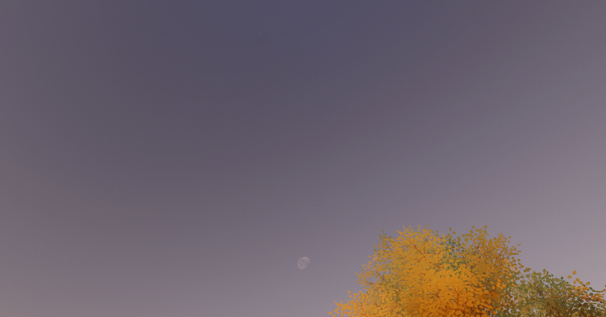
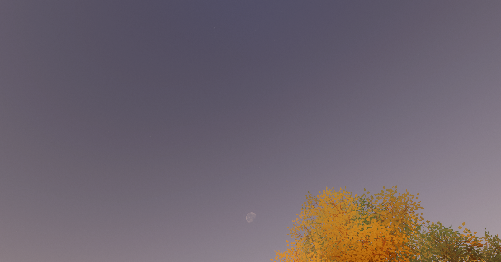
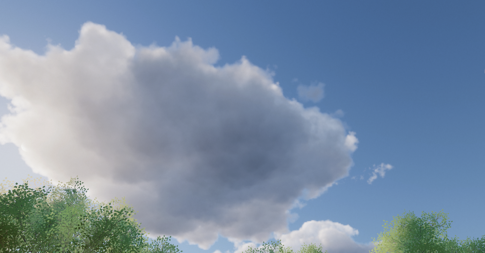
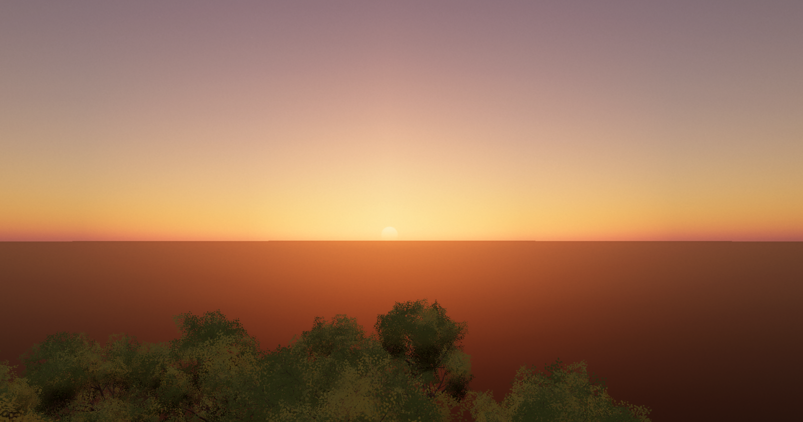
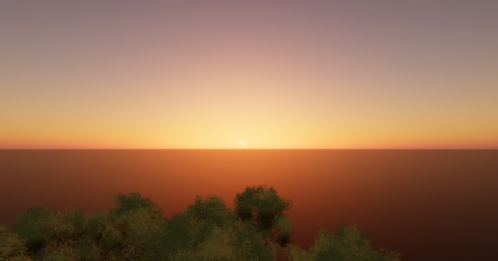
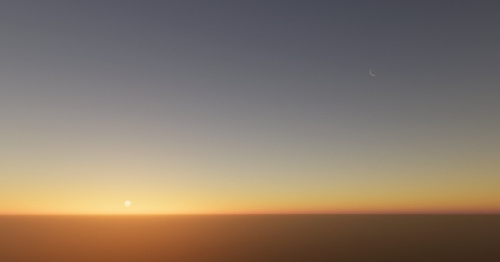

# Quality Settings Block

> Implemented as class `Expanse.QualitySettingsBlock` in `blocks/QualitySettingsBlock.cs`

Quality...

<!---------------------------------------------------------------------------------------->
<!---------------------------------------- GENERAL --------------------------------------->
<!---------------------------------------------------------------------------------------->
### General
These are general quality parameters, relating to post-process effects like anti-aliasing.

#### Anti Aliasing
**C# member variable:** `bool m_antiAlias` \
Whether or not to use MSAA 8x anti-aliasing. MSAA is conditional, only multisampling on the edges of celestial bodies and the ground, so enabling this does not cause much of a performance hit.

#### Dithering
**C# member variable:** `bool m_dither` \
Whether or not to use dithering to reduce color banding. Since expanse computes everything in floating point HDR values, this is more of a de-band operation than a true dither, and you may be better off using a dither post-processing step on your camera.

    

        

        

    

    
Left: without dithering. Right: with dithering. The effect is challenging to see in these images, but fairly obvious in-engine.

<!---------------------------------------------------------------------------------------->
<!---------------------------------------- CLOUDS ---------------------------------------->
<!---------------------------------------------------------------------------------------->
### Clouds
These parameters pertain to global cloud quality. Other quality settings can be set locally on each cloud block you use.

#### Cloud Subresolution
**C# member variable:** `float m_cloudSubresolution` \
Specifies resolution to render clouds at, as a function of the camera resolution. `1` means full resolution. `0.5` means half the screen width and height, so, technically, quarter resolution.

Depending on your needs, you may choose to use this or reprojection (specified in each cloud block), to meet your performance requirements. However, be aware that rendering clouds at a lower resolution will result in a visual downgrade.

This parameter can be particularly useful for 4K support, where you may want to render your geometry in 4K, but render the clouds in HD to keep performance reasonable.

    

        

        

    

    
Left: clouds rendered in full res. Right: clouds rendered at 1/16th res (so a quarter of the screen height and width). It can be hard to tell the difference here, since the images may appear small in the browser, but the right image is blurrier.

<!---------------------------------------------------------------------------------------->
<!-------------------------------------- ATMOSPHERE -------------------------------------->
<!---------------------------------------------------------------------------------------->
### Atmosphere
These parameters pertain to global atmosphere quality.

#### Atmosphere Texture Quality
**C# member variable:** `Expanse.Datatypes.Quality m_atmosphereTextureQuality` \
Quality of atmosphere lookup textures. Lower quality settings will improve performance, at the cost of visual fidelity.

    

        

        

    

    
Left: "Potato"(lowest) quality. Right: "Ripping Through the Metaverse" (highest) quality. Even the lowest quality setting holds up pretty well. Only in special more extreme cases are the higher quality settings necessary.

#### Transmittance Samples
**C# member variable:** `int m_transmittanceSamples` \
The number of samples used when computing transmittance lookup tables. With importance sampling turned on, a value of as low as 10 gives near-perfect results on the ground. A value as low as 4 is ok if some visible inaccuracy is tolerable. Without importantance sampling, a value of 32 or higher is recommended.

#### Aerial Perspective Samples
**C# member variable:** `int m_aerialPerspectiveSamples` \
The number of samples used when computing aerial perspective. With importance sampling turned on, a value of as low as 10 gives near-perfect results on the ground. A value as low as 5 is ok if some visible inaccuracy is tolerable. Without importantance sampling, a value of 16 or higher is recommended.

#### Single Scattering Samples
**C# member variable:** `int m_singleScatteringSamples` \
The number of samples used when computing single scattering. With importance sampling turned on, a value of as low as 10 gives near-perfect results on the ground. A value as low as 5 is ok if some visible inaccuracy is tolerable. Without importantance sampling, a value of 32 or higher is recommended.

#### Multiple Scattering Samples
**C# member variable:** `int m_multipleScatteringSamples` \
The number of samples to use when computing the initial isotropic estimate of multiple scattering. Importance sampling does not apply here. To get a near-perfect result, around 32 samples is necessary. But it is a fairly subtle effect, so as low as 8 samples gives a decent result.

#### Multiple Scattering Accumulation Samples
**C# member variable:** `int m_multipleScatteringAccumulationSamples` \
The number of samples to use when computing the actual accumulated estimate of multiple scattering from the isotropic estimate. The number of samples to use when computing the initial isotropic estimate of multiple scattering. With importance sample, 8 samples gives a near-perfect result. However, multiple scattering is a fairly subtle effect, so as low as 3 samples gives a decent result. Without importance sampling, a value of 32 or higher is necessary for near perfect results, but a value of 4 is sufficient for most needs.

#### Screenspace Occlusion Samples
**C# member variable:** `int m_screenspaceOcclusionSamples` \
The number of samples to use when computing the occlusion estimate for screenspace layers.

#### Importance Sample Atmosphere
**C# member variable:** `bool m_importanceSampleAtmosphere` \
Whether or not to use importance sampling for all atmosphere calculations except aerial perspective. Importance sampling is a sample distribution strategy that increases fidelity given a limited budget of samples. It is recommended to turn it on, as it doesn't decrease fidelity, but does allow for fewer samples to be taken, boosting performance. However, for outer-space perspectives, it can sometimes introduce inaccuracies, so it can be useful to increase sample counts and turn off importance sampling in those cases.

    

        

        

        

    

    
Left: fewer than 4 samples taken per category, with no importance sampling. Middle: fewer than 4 samples taken per category, but this time, with importance sampling. Right: "ground truth" reference with 64 samples taken per category. Importance sampling is able to get startlingly close to the ground truth, with very few samples.

#### Importance Sample Aerial Perspective
**C# member variable:** `bool m_importanceSampleAerialPerspective` \
Whether or not to use importance sampling for aerial perspective. Importance sampling is a sample distribution strategy that increases fidelity given a limited budget of samples. However, it can sometimes cause artifacts or perform poorly when computing aerial perspective, so the option to turn it off for aerial perspective only is provided.

#### Aerial Perspective Depth Skew
**C# member variable:** `float m_aerialPerspectiveDepthSkew` \
Skews precomputed aerial perspective samples to be further from the camera (if less than 1) or closer to the camera (if greater than 1). This is useful for environments with very heavy fog, where it can be more important to capture scattering close to the camera.

#### Screenspace Depth Downscale
**C# member variable:** `int m_screenspaceDepthDownscale` \
Downscale factor for depth buffer used for occlusion in screenspace atmosphere layers. If this factor is lower, performance is worse but the volumetric shadows are sharper. If it's higher, performance is better, but the shadows are blurrier. This can be used to an artistic end. Sometimes the sharp shadows you get when using the full resolution depth buffer are too sharp.

    

        

        

    

    
Left: no downscaling applied to depth buffer. Right: downscale factor of 3 applied to depth buffer. Notice how the crepuscular rays aren't quite as streaky.

<!---------------------------------------------------------------------------------------->
<!--------------------------------------- METADATA --------------------------------------->
<!---------------------------------------------------------------------------------------->
### Metadata
These parameters are metadata or references to components/objects that the block uses.

#### Volume
**C# member variable:** `m_volume` \
The Sky and Fog Volume that backs this quality settings object. In all likelihood, this should be a single global volume you set up at the start of your project. More complex workflows may have multiple local volumes, in which case you will need to create quality settings blocks (one for each volume), or programmatically change this parameter.